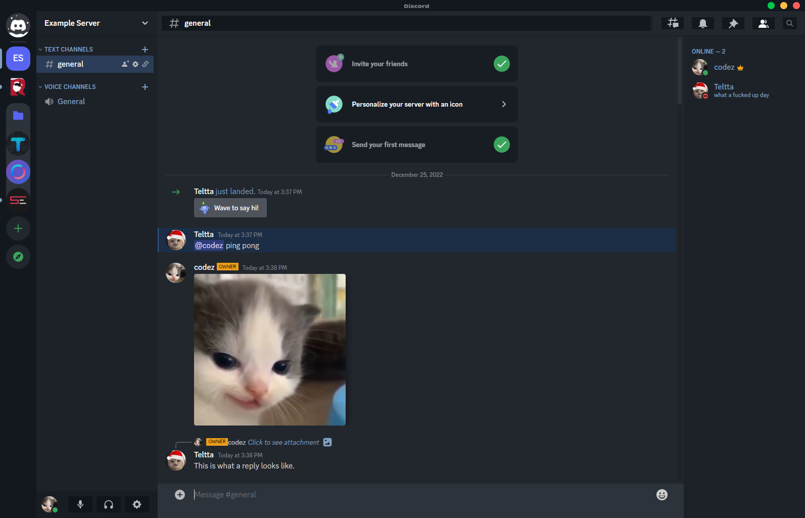
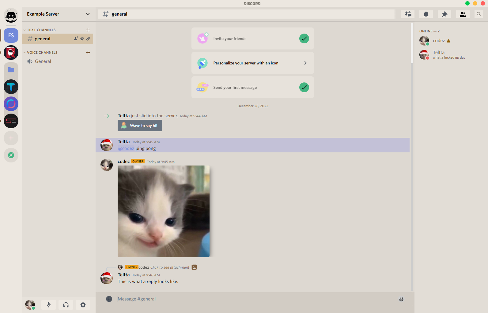

# Fabled Theme For Replugged

## Install

1. Download [this file](https://github.com/Teltta/fabled-theme/releases/latest/download/dev.Teltta.FabledTheme.asar) and put it into your replugged themes folder.
    - **Windows** `%appdata%/replugged/themes`
    - **macOS** `~/Library/Application Support/replugged/themes`
    - **Linux** `~/.config/replugged/themes`

## Screenshots

## Troubleshooting

### Make sure Replugged is installed and running.

Open Discord settings and make sure the Replugged tab is there. If not,
[follow these instructions](https://github.com/replugged-org/replugged#installation) to install
Replugged.

### Make sure the theme is installed.

Check the [theme folder](https://github.com/replugged-org/replugged#installing-plugins-and-themes)
for your OS and make sure the theme is there. If not, make sure you have built the theme and that
the `NO_INSTALL` environment variable is not set.  
You can run `replugged.themes.list().then(console.log)` in the console to see a list of themes in
the theme folder.
